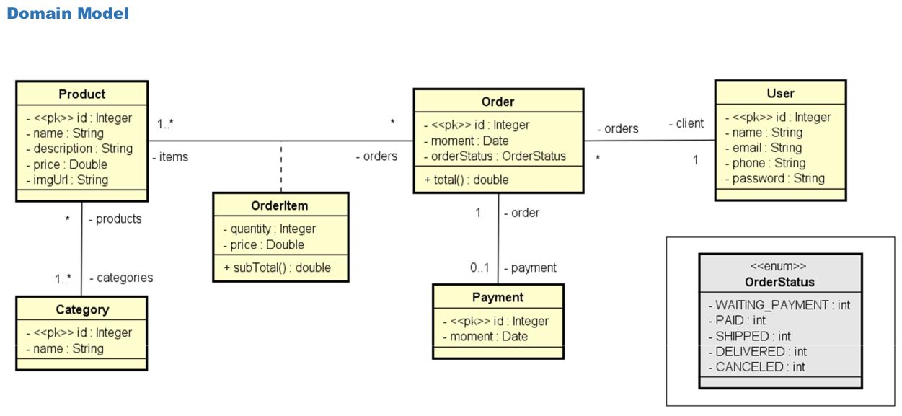

# Estoque

E-commerce, ou comércio eletrônico, é uma modalidade de negócio em que as transações comerciais são realizadas totalmente online.
Desde a escolha do produto pelo cliente, até a finalização do pedido, com o pagamento, todo o processo deve ser realizado por meios digitais.
Nesse tipo de comércio, a única etapa no mundo físico é a da logística de entrega das encomendas aos compradores.

Esse projeto foi desenvolvido a fins didático com o objetivo de usar funcionalidade desenvolvida no curso.



## Como funciona o projeto

O projeto é uma API de um estoque utilizando a arquitetura de software REST para desenvolve o mesmo.
Métodos

* GET
```
    http://localhost:8080/users
```
```
    http://localhost:8080/products
```
```
    http://localhost:8080/categories
```
```
    http://localhost:8080/orders
```

* POST

```Json
http://localhost:8080/users/
{
    "name": "Bob Brown",
    "email": "bob@gmail.com",
    "phone": "977557755",
    "password": "123456"
}
```

* PUT
* 
```Json
http://localhost:8080/users/3

{
    "name": "Bob Brown",
    "email": "bob@gmail.com",
    "phone": "977557755"
}
```

* DELETE
```
   http://localhost:8080/users/8
```

## Funcionamento do projeto Main
As instruções abaixo ir ajudar a roda o main do projeto. Para isso, siga o passo-a-passo abaixo:

1. Baixe o projeto.

2. Execute o arquivo 'EstoqueApplication.java', como main na sua IDE no package com.rodrigoapolo.estoque.

## Tecnologia usada
* Java 17
* API Collection
* Lambda
* Programação Orientada a Objetos (POO)
* Banco de dados H2
* JSON
* Spring boot (3.0.1)
